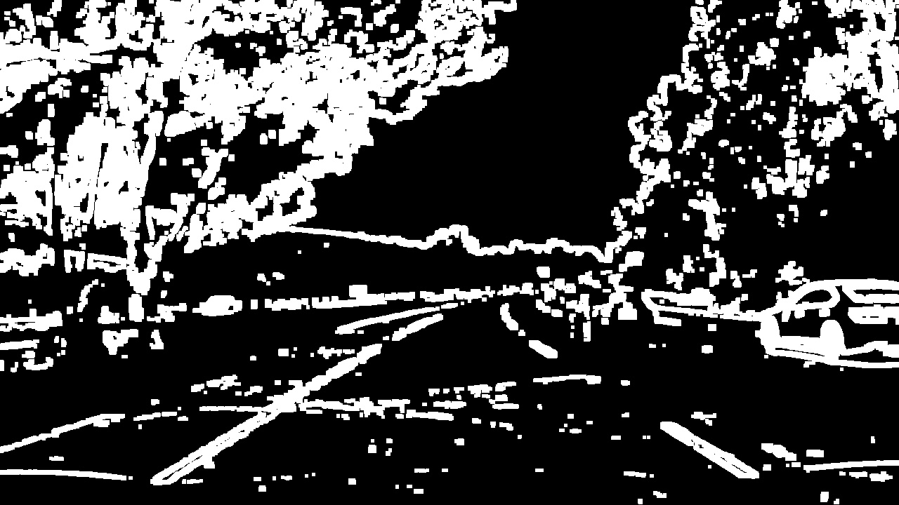
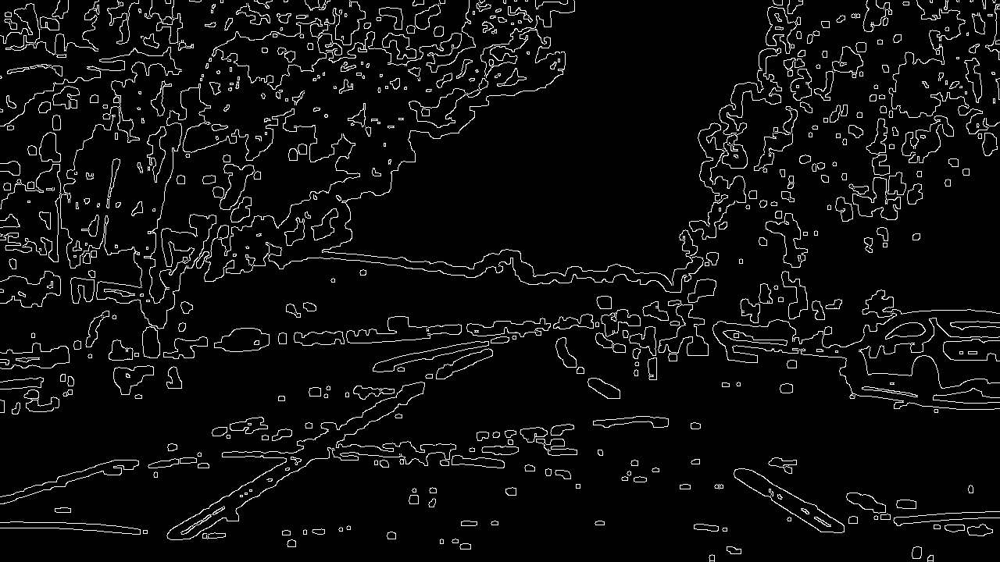
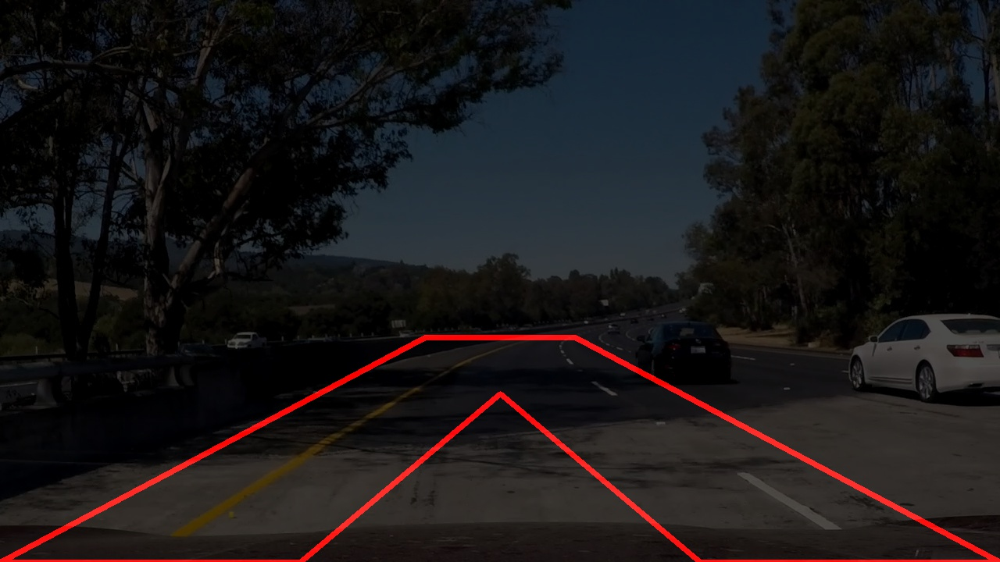
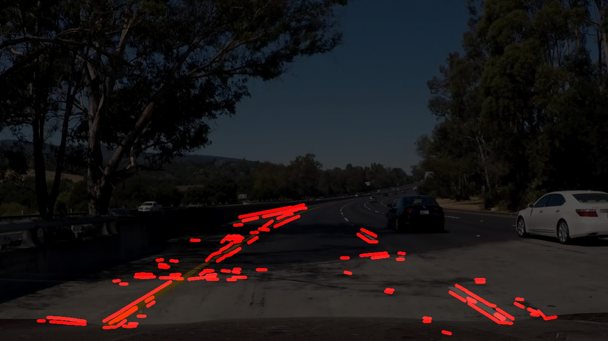
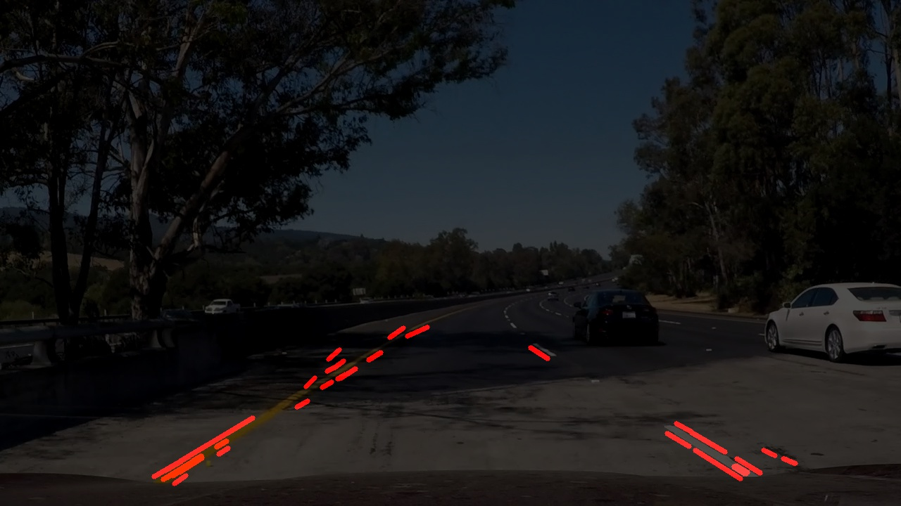
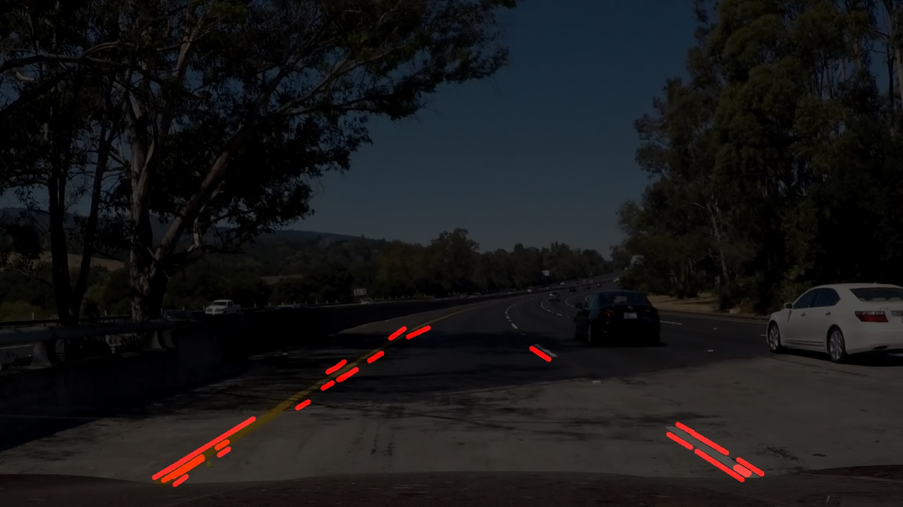
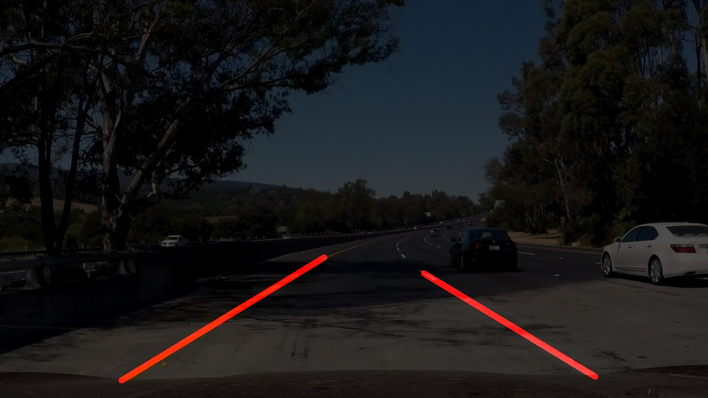
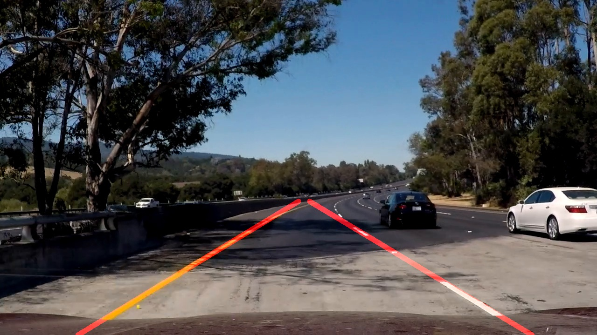
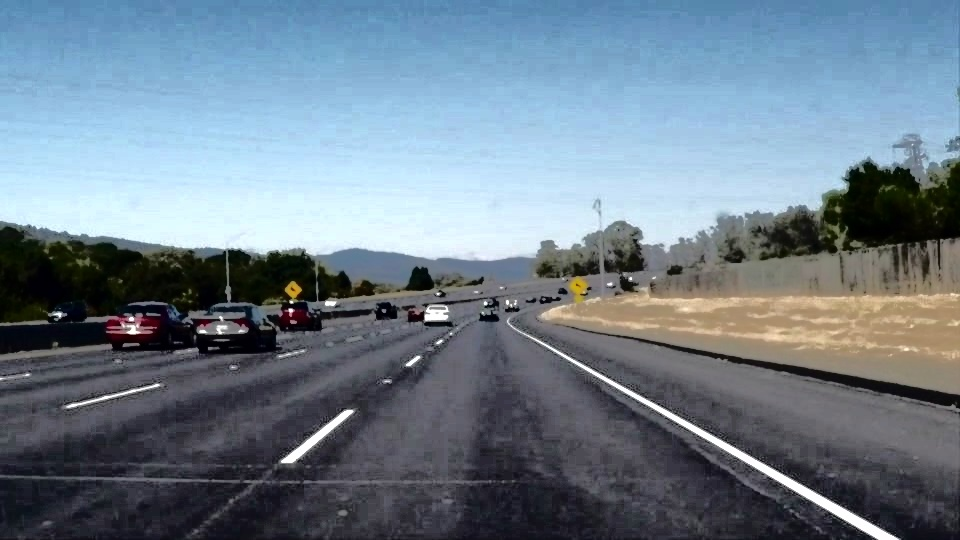

# **Project: Finding Lane Lines on the Road**

The goal of this project is to create a pipeline that finds lane lines on the road.
Therefore some test images in the subfolder `test_images` and two test videos (`test_videos/solidYellowLeft.mp4` and `test_videos/solidWhiteRight.mp4`) are provided by Udacity.
There is also one optional more difficult test video `test_videos/challenge.mp4`.
The image below shows the expected output of the project.

---

**Files in this project**

* the Ipython notebook `P1.ipynb` which contains the code
* the `test_images` folder contains some test images
* the `test_videos` folder contains some test videos
* the code saves the processed test images to the `test_images_output` folder
* the code saves the processed test videos to the `test_videos_output` folder
* the `LICENSE` file
* this `README.md` containing a description of the implementation
* the `examples` folder contains some examples from Udacity

---

**Steps how I implemented this project**

## 1. Extend the Helper Functions for images

`read_img` and `write_img` were added in order to outsource image IO handling.
`write_img` also converts the image before saving it to disk, if it is a color image, from RGB (matplotlib) to BGR (OpenCV).

`hsv` and `hls` convert the color space of the image to HSV or HLS respectively.
They are currently not used, but I tested some line recognition in those color spaces, but this is not finished jet.

`equalize_histogram` normalizes the image, but the output does not enhance the line recognition.

`ensure_color` takes a gray-scale or color image as input and always returns a color image with three channels.

`hough_lines` was split into `hough_lines` and `hough_lines_img`.
`hough_lines` returns the detected lines to the caller, where `hough_lines_img` returns an image with the lines drawn into that image, as the behavior of the original function was.

All other helper function were left as they were provided by Udacity.

## 2. Create some Helper Functions for straights

Additionally there were some more functions added to handle straights and line segments.

`get_straight_params_from_2points` calculates the slop `m` of a straight through two given points and the y-axis intercept `t`.

`get_straight_params_from_line` takes a hough-line as input and also returns `(m,t)` of the straight.

`get_x_for_y_equals` calculates the `x`-coordinate of the interception point of the lines defined by `straight_params` [`(m,t)` which define the line `y=m*x+t`] and some horizontal line defined by `y=<some value>`.

`approximate_line` rejects outliers and averages the start and end of the given lines to approximate a single line.

`extrapolate_line_for_y_range` gets a line as input and extrapolates it between `y_min` and `y_max` or cuts it into that range if it is to long.

## 3. Defining the pipeline

The `detect_lane_lines` pipeline is defined in a corresponding function named equally.
It consists of the following nine steps:

1. `extract_lane_lines` into a binary image
    * first a `morphological gradient` is used to emphasize the lane lines
    * second a `morphological tophat` is used to emphasize **thin** lane lines
    * both images are combined using the maximum of each channel for each pixel
    * next the three color channels are combined into one using the maximum channel for each pixel
    * `morphological dilate` enhances the detected areas (especially useful for thin lane lines in the distance)
    * last a threshold is used to select potential lane lines
    * 
2. `detect_edges` to prepare the image for the hough transformation
    * smooth the binary image with a gaussian blur
    * apply a canny edge detection
    * 
3. select a region of interest
    * 
4. `detect_hough_lines` using the hough transformation
    * 
5. `filter_lines` for left and right lane boundary
    * two lists should be created: `left_lines` and `right_lines`
    * assuming the camera images are taken from a car within the lane boundaries, there should be one lane boundary pointing near to the bottom left corner and one lane boundary pointing near to the bottom right corner of the image
    * therefore at the bottom of the image there are two areas defined (left and right of the ROI)
    * lines which point into the left area are considered to be part of a left lane boundary and are added to the `left_lines` list
    * lines which point into the right area are considered to be part of a right lane boundary and are added to the `right_lines` list
    * all lines also have to point to the top of the ROI in order to be a possible lane boundary
    * 
6. `approximate_line` for left and right lane boundary
    * all operations assume the road is straight (and also the lane boundaries are straights)
    * first `reject_outlier_lines` is used
        * reject lines where their angle is not near to the median of all angles
        * reject lines based on `threshold_distance` to median line (as the lines would be parallel to each other)
        * left and right lines are calculated separately
        * 
    * second the minimum and maximum of the y values is used for the maximal extend of the approximated line (top and bottom lines)
    * each line is intersected with the top and bottom lines
    * the mean of all intersections on the bottom line is used as start point
    * the mean of all intersections on the top line is uses as the end point
    * 
    * one left and one right lane line is added to the lane lines list
7. `extrapolate_line_for_y_range` so lane boundaries are drawn in the whole region of interest
    * the approximated two lines are extrapolated within the ROI
8. draw lane lines into a clear image
9. combine the original image with the drawn lane lines by calling the `weighted_img` function
    * 

## 4. Potential shortcomings with current pipeline

* The current pipeline assumes the road is straight and also the lane boundaries are straights. Curves cannot be detected, because the hough transformation in step 4 does only search for straight lines.
* If the car does a lane change, the lane lines do not point near to the bottom corners any more. The lane lines filter would fail in step 5.
* Also the ROI is hardcoded into the code. If the lines are outside of this region they cannot be detected anymore.

The pipeline was tuned to also work with the `challenge.mp4` video.

## 5. Possible improvements to your pipeline

A possible improvement could be to also use some HLS (prefered over HSV because the white lines can be extracted more easy) filter to select the lines by color.

Another improvement could be to track the lane lines from the last frames of the video to the next frames.

To allow to detect curved lanes it may be an improvement to use a horizontally sliced ROI's and let the hough transformation find lines in each horizontal stripe.

Contrast correction through histogram equalization was tried, but the asphalt got to many different values:

The should also be an image correction added using the intrinsic camera parameters of the camera used.

---

**Installation instructions**
---

## If you have already installed the [CarND Term1 Starter Kit](https://github.com/udacity/CarND-Term1-Starter-Kit/blob/master/README.md) you should be good to go!   If not, you should install the starter kit to get started on this project. ##

**Step 1:** Set up the [CarND Term1 Starter Kit](https://classroom.udacity.com/nanodegrees/nd013/parts/fbf77062-5703-404e-b60c-95b78b2f3f9e/modules/83ec35ee-1e02-48a5-bdb7-d244bd47c2dc/lessons/8c82408b-a217-4d09-b81d-1bda4c6380ef/concepts/4f1870e0-3849-43e4-b670-12e6f2d4b7a7) if you haven't already.

**Step 2:** Open the code in a Jupyter Notebook

If you are unfamiliar with Jupyter Notebooks, check out <A HREF="https://www.packtpub.com/books/content/basics-jupyter-notebook-and-python" target="_blank">Cyrille Rossant's Basics of Jupyter Notebook and Python</A> to get started.

Jupyter is an Ipython notebook where you can run blocks of code and see results interactively.  All the code for this project is contained in a Jupyter notebook. To start Jupyter in your browser, use terminal to navigate to your project directory and then run the following command at the terminal prompt (be sure you've activated your Python 3 carnd-term1 environment as described in the [CarND Term1 Starter Kit](https://github.com/udacity/CarND-Term1-Starter-Kit/blob/master/README.md) installation instructions!):

`> jupyter notebook`

A browser window will appear showing the contents of the current directory.  Click on the file called "P1.ipynb".  Another browser window will appear displaying the notebook.  Follow the instructions in the notebook to complete the project.

---

**License**

[MIT](LICENSE)
